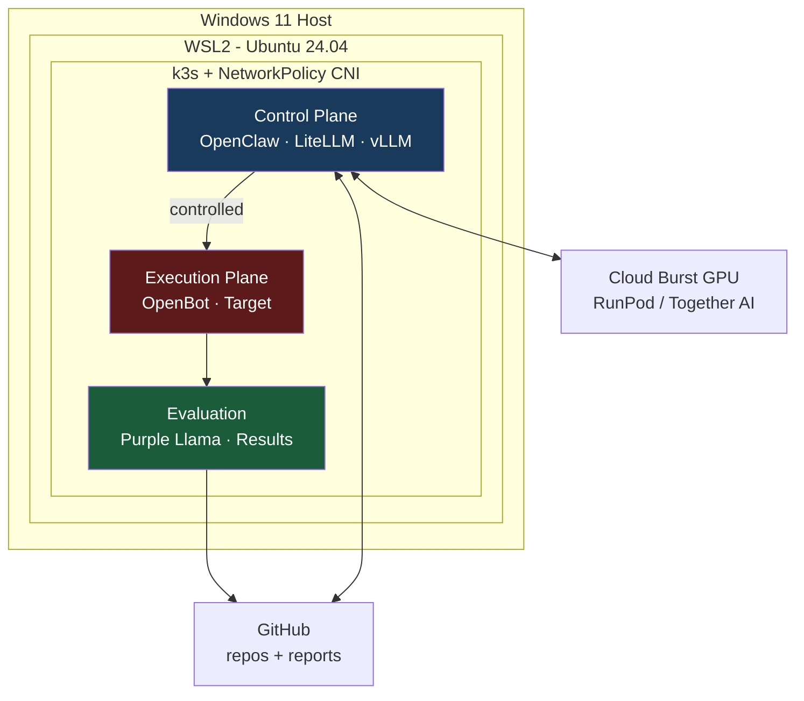
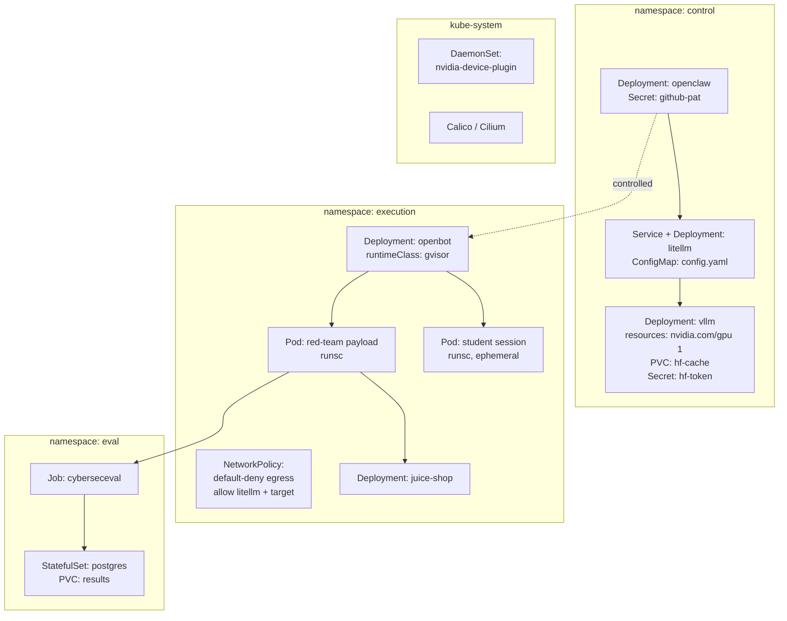

# Architecture

This document describes the architecture of the Red Teaming as Code + Educational Games platform: a hybrid, local-first stack that runs autonomous AI security evaluations and interactive tutoring on the same infrastructure, while keeping the two apart where it matters.

The design follows one principle throughout: **every agent action passes through a gateway that logs it, and executes inside a sandbox that contains it.** Because the platform deliberately runs offensive red-team payloads and untrusted student code, the architecture separates a *trusted control plane* from an *untrusted execution plane*, and relies on enforced network policy — not just namespaces — to keep them apart.

> **Component note:** `OpenClaw` and `OpenBot` are the agent-automation and sandboxing components. Confirm exact project names and that each supports the capabilities this design assumes (gVisor/`runsc` sandboxing, Kubernetes daemon mode) before building against them.

## Design principles

- **Two trust domains, one platform.** The control plane holds the secrets and the brains; the execution plane runs hostile code. They share a cluster but not a namespace, and the execution plane cannot reach the control plane's secrets.
- **Gateway in the middle.** All inference — local or cloud — is brokered by LiteLLM, which is also the audit and routing point. Nothing calls a model directly.
- **Contain, then execute.** Payloads and student code run under gVisor (`runsc`) inside the execution plane, behind a default-deny egress policy.
- **Local first, burst when needed.** Light work runs on a local quantized model; only heavy generation and evaluation bursts to pay-per-use cloud GPU.
- **Least privilege on the crown jewels.** The GitHub PAT and Hugging Face token are minimally scoped, short-lived, and never reachable from the execution plane.

## High-Level Design

The high-level view shows the three logical zones — control, execution, evaluation — running inside a single k3s cluster on WSL2, with two external dependencies: GitHub (triggers in, reports out) and a serverless GPU provider for burst compute. The colour coding marks the trust boundary: blue is trusted, red is untrusted, green is evaluation.

## Low-Level Design

The low-level view maps the logical zones onto concrete Kubernetes resources — Deployments, Services, Secrets, ConfigMaps, PVCs, and the NetworkPolicy that enforces the boundary. Each namespace corresponds to a trust domain. Note the `runtimeClass: gvisor` on the sandbox pods and the default-deny egress policy on the execution namespace: these are the two controls the whole isolation story depends on.

## Component reference

| Component | Namespace | Role | Key resources |
| --- | --- | --- | --- |
| OpenClaw | control | Autonomous agent; monitors repos, triggers pipelines | Deployment, Secret (GitHub PAT, min-scope) |
| LiteLLM | control | Inference gateway, routing, audit log, guardrails | Service, Deployment, ConfigMap |
| vLLM | control | Local inference on a quantized model | Deployment, GPU request, PVC (HF cache), Secret (HF token) |
| OpenBot | execution | Provisions gVisor-isolated sandboxes | Deployment, `runtimeClass: gvisor` |
| Target app | execution | Deliberately vulnerable attack target | Deployment (e.g. OWASP Juice Shop) |
| Purple Llama | eval | Llama Guard filtering + CyberSecEval scoring | Job |
| Results store | eval | Attack history and posture trend over time | StatefulSet, PVC |
| NVIDIA device plugin | kube-system | Exposes GPU to pods | DaemonSet |
| CNI (Calico/Cilium) | kube-system | Enforces NetworkPolicy — k3s default Flannel does not | cluster-wide |

## Infrastructure baseline

- **Host:** Windows 11 + WSL2 (Ubuntu 24.04), WSL2 memory hard-capped via `.wslconfig`, 200 GB NVMe for the `.vhdx`.
- **GPU:** NVIDIA WDDM driver passes through to WSL2; NVIDIA Container Toolkit inside Ubuntu; device plugin DaemonSet in k3s. Quantized models only (4-bit AWQ/GPTQ, ~5.5–6 GB VRAM).
- **Cluster:** k3s (single-binary, low overhead). **Replace the default Flannel CNI with Calico or Cilium** so NetworkPolicy is actually enforced.
- **Cost model:** control plane and light inference run locally at $0; only heavy generation and evaluation burst to serverless GPU, billed per use.

## Trust boundary — read this before deploying

The execution plane runs code assumed to be hostile. The following are not optional:

1. **Enforced NetworkPolicy.** Default-deny egress on the `execution` namespace; allow only LiteLLM and the target. Requires a policy-capable CNI (above).
2. **gVisor on every sandbox.** `runtimeClass: gvisor` on OpenBot pods. **Verify `runsc` runs under WSL2 before building** — nested virtualization can block it. If GPU is needed inside a sandbox, test gVisor's GPU support (nvproxy) explicitly; prefer keeping sandboxes CPU-only and GPU in the trusted plane.
3. **Crown-jewel scoping.** GitHub PAT: fine-grained, single throwaway target repo (ideally a dedicated org), short expiry. HF token: read-only, gated-model pull only. Neither is mounted into the execution namespace.
4. **Plane separation.** Consider a dedicated k3s node for the execution plane so a sandbox breakout lands on a node with no control-plane secrets.
