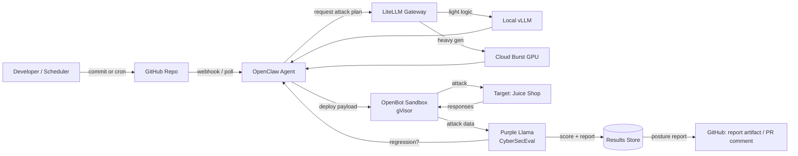
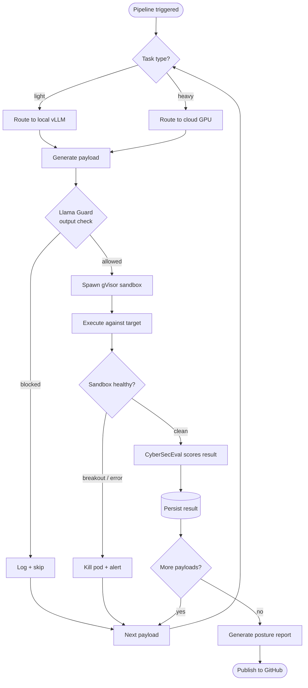
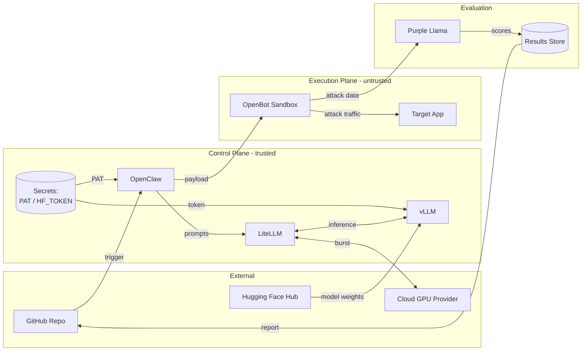
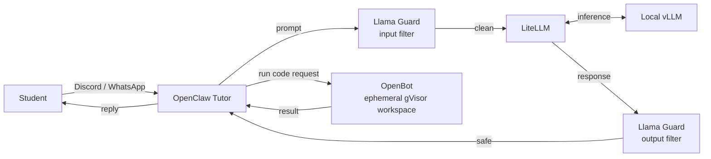

# Workflows & Data Flow

This document walks through how the platform actually runs: the end-to-end workflow of a red-team pipeline, the decision logic of a single run, and how data moves between components and trust zones. Read [Architecture](architecture.md) first for the static structure; this document is the moving picture.

## Red Teaming as Code — end-to-end workflow

A run begins with a commit or a scheduled trigger and ends with a security posture report published back to GitHub. OpenClaw plans the attack through the LiteLLM gateway (which decides local vs. cloud inference), executes payloads inside a gVisor sandbox against a defined target, and hands the results to Purple Llama for scoring. Results persist so posture can be tracked across runs, and a regression can feed straight back into the next planning cycle.

## Decision logic of a single run

Zooming into one pipeline execution: each payload is routed by task weight, checked by Llama Guard before it runs, executed only inside a healthy sandbox, and scored. A sandbox breakout or error kills the pod and alerts rather than continuing. The loop repeats per payload until the plan is exhausted, then the posture report is generated and published.

## Data Flow Diagram

This view drops the sequencing and shows *what data goes where*, grouped by trust zone. Note the direction of the sensitive flows: secrets flow only into the control plane; attack traffic is confined between the execution plane's sandbox and its target; only scored results — not raw payloads or credentials — leave for GitHub.

## The second track — educational games

The tutoring track reuses the same platform with the opposite trust posture: a student interacts through a chat front end, Llama Guard filters input and output to prevent prompt injection and unsafe content, and any code the student runs executes in an ephemeral gVisor sandbox — the same isolation the red-team payloads use, for the same reason.

Keeping the two tracks as separate deployments on the shared platform ensures a student session and an offensive payload never share a namespace, even though they run the same underlying components.
